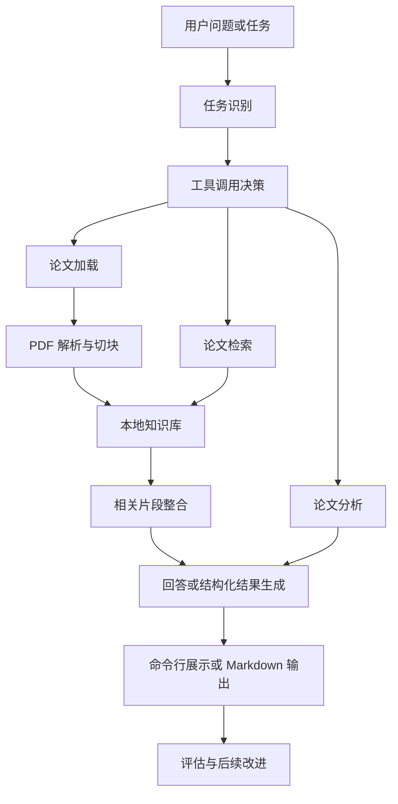

# CityScholar-Agent 课程总览

## 1. 总体智能体设计架构

### 1.1 项目定位

CityScholar-Agent 是一个面向城市治理、城市规划与城市安全方向的学术文献科研助教智能体。
当前课程版本以本地论文知识库为基础，围绕“最小智能体 -> 工具调用 -> LangChain/LangGraph -> RAG -> 评估”逐步展开。

### 1.2 总体设计原则

- 城市问题是主语，AI 与智能体是方法。
- 论文知识库是基础，科研任务完成是目标。
- 先保证最小可运行，再逐步增强检索、比较、综述与评估能力。
- 每周只引入有限的新概念，让学生能把代码、流程和结果对应起来。

### 1.3 总体架构图

### 1.4 当前最小系统对应模块

- `app.py`：命令行入口，负责启动知识库、接收用户输入、分发问答与分析任务。
- `core/agent.py`：主智能体逻辑，负责组织建库、检索、回答与单篇论文分析。
- `core/prompts.py`：当前最小回答与兜底提示模板，为后续接入真实大模型保留接口。
- `rag/loader.py`：扫描本地 `PDF` 论文文件。
- `rag/parser.py`：解析 `PDF` 文本，生成统一文档对象。
- `rag/splitter.py`：切块并生成最小检索记录。
- `rag/retriever.py`：执行当前最小检索。
- `tools/analyze_tool.py`：执行单篇论文结构化提取。

### 1.5 当前版本与课程主线的关系

- 当前版本已经满足第 1 周“最小智能体”的教学需要。
- 当前版本已经部分进入第 4 周 RAG 的基础阶段，因为已具备本地论文解析、切块与检索原型。
- 多篇论文对比、综述提纲生成、embedding 检索与评估模块仍属于后续周次任务。

---

## 2. 每周任务概况（简版）

### 第 1 周：最小科研助教智能体

目标：让学生理解什么是“围绕科研任务工作的最小智能体”。

本周核心任务：
- 认识项目定位与学科边界。
- 理解最小闭环：输入问题 -> 检索片段 -> 生成回答。
- 讲清 `app.py`、`core/agent.py`、`core/prompts.py` 的职责。
- 跑通一个最小命令行 demo。

本周产出：
- 一个本地可运行的最小智能体原型。

### 第 2 周：工具调用与模块化

目标：让系统从“会答”走向“会做”。

本周核心任务：
- 理解工具在智能体中的作用。
- 增加结构化工具接口。
- 实现多篇论文对比工具。
- 介绍模块化设计与工程注释规范。

本周产出：
- 一个可调多个工具的科研助教原型。

### 第 3 周：LangChain / LangGraph 与多步流程

目标：让系统具备流程控制和状态意识。

本周核心任务：
- 介绍链式调用与图式流程的区别。
- 将多步任务拆为节点与状态。
- 为论文比较、综述生成设计多步流程。

本周产出：
- 一个带有简单状态管理和任务编排能力的增强版本。

### 第 4 周：RAG 接入本地论文知识库

目标：把本地论文知识库真正纳入智能体主线。

本周核心任务：
- 完整讲清 PDF 解析、切块、向量化、索引与召回。
- 将检索器视为工具接入智能体。
- 用引用片段支撑回答。
- 引入 embedding 检索与更稳健的 Top-k 召回。

本周产出：
- 一个带本地论文知识库的 RAG 科研助教。

### 第 5 周：评估、边界与扩展

目标：对系统进行系统性收口。

本周核心任务：
- 评估检索效果与回答质量。
- 检查多论文比较与综述结果是否失真。
- 做错误分析与边界说明。
- 简要展望 GraphRAG、多智能体与在线论文检索。

本周产出：
- 一套可演示、可解释、可评估的课程原型系统。

---

## 3. 当前代码与后续任务边界

### 当前已完成

- 本地 PDF 扫描与解析。
- 文本切块与最小知识库构建。
- 最小问答闭环。
- 单篇论文结构化提取原型。
- 命令行交互入口。

### 明确属于后续任务

- 多篇论文对比。
- 综述提纲生成。
- embedding / 向量索引。
- 元数据过滤与混合检索。
- 评估脚本与测试问题集。
- LangChain / LangGraph 流程编排。

---

## 4. 建议的 notebook 组织方式

建议后续按下列文件持续迭代：

- `notebooks/00_课程总览.md`
- `notebooks/01_最小科研助教智能体.md`
- `notebooks/02_工具调用与模块化.md`
- `notebooks/03_LangGraph与多步科研任务.md`
- `notebooks/04_本地论文知识库与RAG.md`
- `notebooks/05_评估与扩展.md`

每份讲义建议都固定四段：

1. 本周目标
2. 本周系统结构
3. 本周核心代码讲解
4. 本周练习任务
