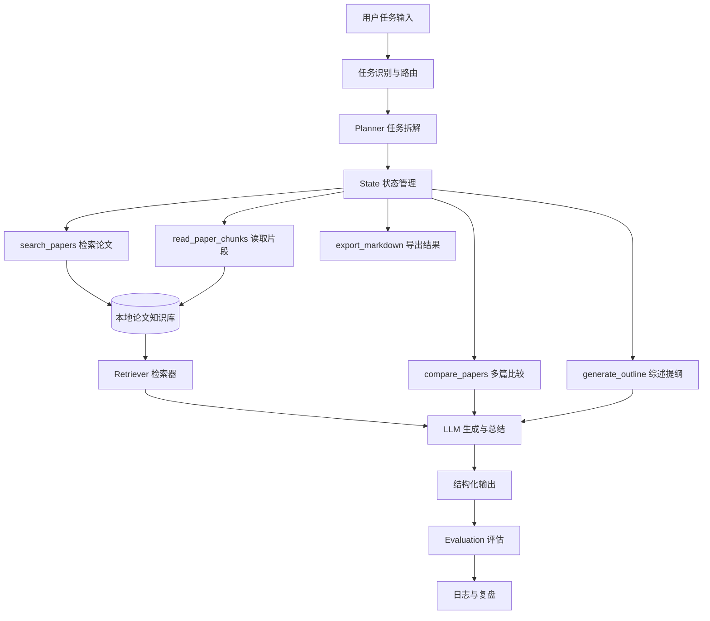

# CityScholar-Agent 课程总览

> 🧭 这份总览负责搭建整门课的全局地图：课程要去哪里、当前代码走到哪里、后续能力会怎样长出来。

---

## 1. 这门课主要回答三个问题

1. 什么是围绕科研任务运行的智能体。
2. 一套最小系统如何逐步扩展成可用的科研助教系统。
3. 当前代码仓库中的模块分别对应课程的哪个阶段。

### 本节小结

先看整体地图，再进入每一周，理解会更完整。

---

## 2. 课程定位与课程主线

### 2.1 项目定位

CityScholar-Agent 是一个面向城市治理、城市规划与城市安全方向的学术文献科研助教智能体。
课程围绕“最小智能体 -> 工具调用 -> 流程编排 -> 本地知识库与 RAG -> 评估与扩展”逐步展开。

### 2.2 课程目标

这门课不把重点放在“做一个会聊天的程序”，而是把重点放在“做一个能围绕科研任务工作的系统”。
完成课程后，需要清楚理解：

- 什么是最小智能体。
- 为什么工具调用是智能体能力的重要分界线。
- 为什么本地论文知识库是科研场景中的核心基础设施。
- 为什么评估不能放到最后再补。

### 2.3 课程主线

```text
最小智能体
-> 工具调用
-> 流程编排（LangChain / LangGraph）
-> 本地知识库与 RAG
-> 评估与扩展
```

<div align="center">
  <br>
  <sub><b>Figure 10.</b> 课程主线与能力结构</sub>
</div>

### 2.4 这一条主线在回答什么

- 第 1 周回答：最小智能体到底是什么。
- 第 2 周回答：智能体怎样调用工具完成任务。
- 第 3 周回答：多步任务如何拆解、组织与推进。
- 第 4 周回答：知识库怎样接入系统并服务问答。
- 第 5 周回答：一个系统怎样被评价、修正与扩展。

### 本节小结

课程主线不是把模块一个个堆起来，而是围绕“科研任务如何被系统完成”逐步补足能力。

---

## 3. 总体智能体设计架构

### 3.1 设计原则

- 城市问题是应用主线，智能体是解决问题的方法。
- 论文知识库是基础，任务闭环是目标。
- 优先保证最小可运行，再逐步增强检索质量与任务复杂度。
- 所有模块都应该做到可解释、可演示、可迭代。

### 3.2 总体架构图



### 3.3 分层理解

| 层级 | 作用 | 当前对应文件 | 后续增强方向 |
| --- | --- | --- | --- |
| 输入层 | 接收问题、命令与任务 | `app.py` | Web 界面、API 接口 |
| 协调层 | 判断任务、调度模块 | `core/agent.py`、`core/prompts.py` | Planner、State、工作流编排 |
| 知识处理层 | 论文加载、解析、切块、检索 | `rag/` | embedding、向量索引、rerank |
| 工具层 | 执行结构化科研任务 | `tools/analyze_tool.py` | compare / outline / export |
| 输出层 | 组织回答、展示依据、导出结果 | `app.py` | Markdown、报告、可视化结果 |

### 3.4 当前项目在整张架构图中的位置

当前已经跑通的是：

- 输入层的命令行交互。
- 协调层的最小路由。
- 知识处理层中的 PDF 解析、切块与最小检索。
- 工具层中的单篇论文结构化提取。

当前还没有完成的是：

- 多篇论文比较。
- 综述提纲生成。
- embedding 与向量索引。
- 更正式的多步流程编排与系统评估。

### 课堂问题

1. 如果只有“问答”，为什么还不能称为完整科研智能体？
2. 如果只有“知识库”，为什么还不足以完成科研任务？
3. 为什么课程不是先讲大模型，而是先讲最小闭环？

### 本节小结

这张架构图的重点不是复杂，而是清楚：输入从哪里来，知识在哪里，工具怎么接，输出怎么形成。

---

## 4. 每周任务概况（简版）

| 周次 | 本周主题 | 关键问题 | 预期产出 | 当前状态 |
| --- | --- | --- | --- | --- |
| 第 1 周 | 最小科研助教智能体 | 最小闭环是什么 | 命令行最小智能体原型 | 已完成核心原型 |
| 第 2 周 | 工具调用与模块化 | 智能体怎样调用工具 | 多个科研工具接口 | 后续任务 |
| 第 3 周 | LangChain / LangGraph 与多步流程 | 多步任务如何组织 | 初步流程图与状态流 | 后续任务 |
| 第 4 周 | 本地论文知识库与 RAG | 知识如何支撑回答 | embedding 检索与知识增强 | 后续任务 |
| 第 5 周 | 评估、边界与扩展 | 系统如何评估与改进 | 评估指标、案例与扩展建议 | 后续任务 |

### 4.1 当前代码与周次关系

- 第 1 周：已经具备最小可运行闭环。
- 第 2 周：只有 `analyze_tool` 的雏形，其他工具还需要继续补。
- 第 3 周：还没有正式引入流程编排框架。
- 第 4 周：已经有加载、解析、切块、关键词检索，但还没有 embedding。
- 第 5 周：评估与测试体系还没有开始搭建。

### 本节小结

课程不是五块彼此独立的内容，而是一条连续推进的能力链。

---

## 5. 课程中的关键追问

> 下面这些问题会在 5 周里反复出现，它们构成整门课的核心线索。

### 5.1 关于系统

- 智能体和普通脚本的边界在哪里？
- 智能体和聊天机器人有什么本质区别？
- 一个系统“能跑”与“能用”之间差什么？

### 5.2 关于知识

- 为什么科研场景必须强调来源依据？
- 为什么需要把论文变成知识对象，而不是直接堆 PDF？
- 为什么后面一定会走到 embedding、RAG 与评估？

### 5.3 关于工程

- 为什么先做最小版本，而不是一开始就追求复杂功能？
- 为什么要分成 `app / core / rag / tools` 这样的结构？
- 为什么“模块边界清楚”本身就是课程重点？

### 本节小结

带着问题推进课程，比单纯记模块名称更重要。

---

## 6. Notebook 中的代码观察单元

下面保留几个代码单元位置，便于在 notebook 中直接做轻量演示。

### 6.1 查看项目目录

---

### 6.2 查看当前讲义对应的核心源码文件

---

## 7. 本份总览的结尾提示

### 进入第一周之前，需要先记住三句话

1. 先跑通最小闭环，再追求更强能力。
2. 先把结构讲清楚，再把功能做复杂。
3. 先让系统有来源依据，再讨论回答质量。

### 本节总小结

这份总览解决的是全局地图问题：整门课要去哪、当前代码走到哪、后面还会怎么继续长出来。

---

## 大模型 API 接入（DashScope）

### 当前项目为什么接入大模型

当前最小智能体已经能跑通闭环，但在两个点上还有明显上限：

- 规则式分析容易误抽参考文献噪声（例如 `& Zhou, 2024`）
- 关键词检索后的回答更像“片段拼接”，可读性与总结能力有限

接入大模型后，系统会在现有检索和分析结果基础上做增强，同时保留失败回退能力。

### 场景化模型选择（默认）

| 场景 | 默认模型 | 选择理由 |
| --- | --- | --- |
| 问答增强 | `qwen-plus` | 性价比较高，适合高频问答整理 |
| 单篇结构化分析 | `qwen-max` | 准确性更稳，适合结构化抽取 |

### 与课程周次的对应关系

- 第 1 周：最小闭环仍然成立，模型接入是“可选增强”
- 第 2 周：可以系统讲“工具 + 模型”协作
- 第 4 周：和 embedding / RAG 一起形成更完整的检索-生成链路

### 环境变量

```bash
DASHSCOPE_API_KEY=你的密钥
DASHSCOPE_ANSWER_MODEL=qwen-plus
DASHSCOPE_ANALYSIS_MODEL=qwen-max
DASHSCOPE_TIMEOUT_SEC=45
```

### 运行行为说明

- 未设置 `DASHSCOPE_API_KEY`：走纯本地最小逻辑
- 已设置 `DASHSCOPE_API_KEY`：自动启用大模型增强
- 网络或 API 失败：自动回退到本地最小逻辑
