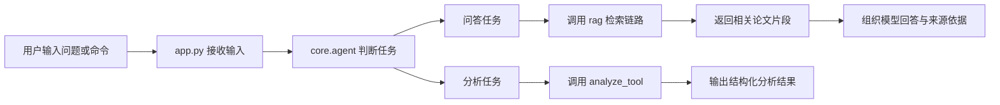

# 第 1 周：最小科研助教智能体

> 🎯 这一周的目标不是做一个“功能很多”的系统，而是把最小闭环真正跑通，并把每一层职责讲清楚。

---

## 1. 本周目标

### 1.1 本周要完成什么

- 理解“最小科研助教智能体”的定义。
- 跑通一条从输入到输出的最小闭环。
- 看懂第一周对应的代码结构与模块职责。
- 通过命令行完成最小问答与单篇论文结构化分析。

### 1.2 本周完成后应该清楚什么

- 为什么这已经是一个程序，而不只是零散代码。
- 为什么它已经可以称为最小智能体原型。
- 为什么后面还要继续做工具、多步流程和 RAG 增强。

### 本节小结

第一周解决的是“从 0 到 1”，不是“从 1 到 100”。

---

## 2. 本周核心问题

1. 什么是科研助教智能体？
2. 什么叫“最小闭环”？
3. 一个最小智能体至少需要哪些模块？
4. 为什么要把问答和分析都纳入同一个系统？
5. 为什么当前版本还不是最终版？

### 本节小结

先把问题框住，再看代码，理解会更稳。

---

## 3. 最小科研助教智能体的定义

在这门课里，最小科研助教智能体指的是一个能够围绕科研任务完成基本工作的系统。它至少需要具备四件事：

- 能接收输入。
- 能调用已有知识。
- 能完成一个具体任务。
- 能输出结果并给出来源依据。

当前的 CityScholar-Agent 已经具备：

- 问答任务：根据问题召回相关论文片段并输出回答。
- 分析任务：对单篇论文做结构化提取。
- 来源展示：把论文名称、页码、片段内容一起输出。

### 一句话理解

最小智能体不是“最简陋的聊天程序”，而是“最小可运行的任务系统”。

### 本节小结

判断一个原型是否像智能体，关键不在于模型有多强，而在于它是否围绕任务闭环工作。

---

## 4. 第 1 周最小闭环

### 4.1 当前最小闭环流程图



### 4.2 真实数据流

```text
PDF 文件 -> 解析文本 -> 切成片段 -> 构建最小知识库 -> 检索相关片段 -> 输出回答与来源
```

### 4.3 这个闭环为什么成立

- 有明确输入。
- 有实际知识源。
- 有任务分流。
- 有结构化输出。
- 有可追溯的来源依据。

### 课堂问题

1. 如果去掉“来源依据”，这个系统还适合科研场景吗？
2. 如果只有 `PDF -> 回答`，中间没有切块和检索，会有什么问题？

### 本节小结

最小闭环的价值在于把路径打通，而不是一次做到完美。

---

## 5. 第一周代码结构与内容说明

### 5.1 目录结构

```text
CityScholar-Agent/
├─ app.py
├─ config.py
├─ core/
│  ├─ agent.py
│  └─ prompts.py
├─ rag/
│  ├─ loader.py
│  ├─ parser.py
│  ├─ splitter.py
│  └─ retriever.py
├─ tools/
│  └─ analyze_tool.py
└─ data/
   └─ raw_papers/
```

### 5.2 文件职责表

| 文件 | 当前职责 | 第 1 周关注重点 |
| --- | --- | --- |
| `app.py` | 程序入口与命令行交互 | 输入、启动、输出 |
| `config.py` | 简洁配置管理 | 路径与目录约定 |
| `core/agent.py` | 协调问答与分析流程 | 最小智能体的“大脑” |
| `core/prompts.py` | 提示词与兜底文案 | 为后续接入模型预留接口 |
| `rag/loader.py` | 发现 PDF 文件 | 知识链路起点 |
| `rag/parser.py` | 解析 PDF 文本 | 统一文档对象 |
| `rag/splitter.py` | 基础切块 | 让长文可被检索 |
| `rag/retriever.py` | 最小检索 | 关键词召回而非 embedding |
| `tools/analyze_tool.py` | 单篇论文结构化提取 | 任务型工具雏形 |

### 5.3 第一周真正要看懂的三层

- 入口层：`app.py`
- 协调层：`core/agent.py`
- 知识链路：`rag/loader.py -> parser.py -> splitter.py -> retriever.py`

### 本节小结

第 1 周不是逐个文件细抠，而是先看清“哪一层负责什么”。

---

## 6. 核心代码说明

### 6.1 `app.py`

`app.py` 是系统入口，负责：

- 准备目录。
- 构建知识库。
- 打印启动信息。
- 接收用户输入。
- 把输入分发给问答或分析流程。

#### 关键认识

入口层要尽量简单，它负责接线，不负责塞入过多业务逻辑。

### 6.2 `core/agent.py`

`core/agent.py` 是当前系统的协调中心，负责：

- 建库。
- 列出论文。
- 执行问答。
- 执行单篇论文结构化分析。

#### 关键认识

智能体不是一个巨大函数，而是一个会调用模块、组织任务、整理结果的协调者。

### 6.3 `core/prompts.py`

虽然当前版本还没有正式接入真实 LLM，但 `core/prompts.py` 已经预留了提示词层。

#### 关键认识

先把接口边界留出来，再逐步增强能力，是很典型也很重要的工程思路。

### 6.4 `rag/retriever.py`

当前检索基于关键词匹配与简单打分。

#### 关键认识

这一版能跑通最小闭环，但不是最终检索方案；embedding 会在后续版本中补上。

### 本节小结

读代码时不要只盯函数细节，更重要的是看模块之间怎样接起来。

---

## 7. 代码观察单元

### 7.1 查看程序入口文件的开头

---

### 7.2 查看核心代理中最重要的方法名称

---

### 7.3 查看当前 `rag/` 目录

---

## 8. 演示命令与建议观察点

### 8.1 启动系统

```bash
python app.py
```

观察点：

- 发现了多少篇 PDF。
- 解析成功多少篇。
- 生成了多少可检索片段。
- 程序是否进入交互模式。

### 8.2 查看论文列表

```text
papers
```

观察点：

- 系统是否已经识别论文对象。
- 是否展示了文档编号、页数与字符数。

### 8.3 执行单篇论文分析

```text
analyze
```

观察点：

- 是否输出结构化字段。
- 是否带有依据片段。
- 当前规则式抽取有没有明显误差。

### 8.4 执行最小问答

```text
哪些论文关注城市安全或韧性？
```

或：

```text
城市韧性研究对城市治理有哪些启示？
```

观察点：

- 输出是否区分“模型回答”和“来源依据”。
- 来源中是否带有论文名、页码、片段编号。
- 当前检索质量还有哪些不足。

### 本节小结

演示命令不是为了展示炫技，而是为了验证闭环真的存在。

---

## 9. 课堂问题

1. 为什么 `papers` 这个命令很重要？
2. 为什么问答输出里一定要保留“来源依据”？
3. 为什么 `analyze` 比单纯问答更像科研任务？
4. 为什么现在的检索结果有时不够理想？
5. 如果后面加入 embedding，这一周的哪一层会被增强？

### 本节小结

问题本身就是课程推进的抓手。

---

## 10. 当前最小系统的局限性

当前版本已经是程序，但还只是最小原型。主要局限包括：

- 检索还是关键词匹配，不是 embedding 检索。
- 中文问题对英文论文的召回能力还不稳定。
- 单篇分析是规则式提取，质量还不够稳。
- 还没有多篇论文对比。
- 还没有综述提纲生成。
- 还没有系统评估模块。

### 一句话理解

这套系统已经解决了“能不能跑”的问题，接下来要解决的是“能不能更准、更强”。

### 本节小结

指出局限不是否定系统，而是为后续迭代建立清楚方向。

---

## 11. 本周与后续周次的连接

### 第 1 周结束后，系统已经具备

- 一个真正可运行的命令行程序。
- 最小论文知识链路。
- 最小问答闭环。
- 单篇论文结构化分析雏形。

### 接下来会自然进入什么

- 第 2 周：把“分析”扩展成更多工具。
- 第 3 周：把简单分流扩展成多步流程。
- 第 4 周：把关键词检索升级成 embedding 与 RAG。
- 第 5 周：给系统加入评估与复盘。

### 本节小结

第一周不是孤立起点，而是后面所有增强工作的地基。

---

## 12. 本周练习

### 练习 1

运行 `python app.py`，记录以下信息：

- 发现 PDF 数量
- 解析成功论文数
- 可检索片段数
- 解析失败论文数

### 练习 2

依次执行：

```text
papers
analyze
```

观察系统输出的结构化字段和来源依据。

### 练习 3

尝试分别输入一个中文问题和一个英文问题，比较当前检索效果。

### 本节小结

练习的重点是验证系统行为，而不是追求一次得到完美答案。

---

## 大模型增强版（本周可选）

### 已接入能力

当前命令行程序已支持 DashScope API，且按场景自动选模型：

- 问答：`qwen-plus`
- 单篇结构化分析：`qwen-max`

### 实际效果

1. 问答输出更像“学术助手总结”，不是简单片段拼接
2. 单篇结构化提取更稳定，参考文献噪声误抽会明显减少
3. 仍保留最小逻辑兜底，避免课堂演示因网络波动中断

### 使用方式

```bash
# Windows PowerShell
$env:DASHSCOPE_API_KEY="你的密钥"
python app.py
```

启动后会显示：

- `大模型增强：已启用`
- `问答模型：qwen-plus`
- `分析模型：qwen-max`

### 注意边界

- 这一步主要提升“生成质量”和“结构化抽取质量”
- 检索召回质量的核心提升仍在后续 embedding / RAG 阶段
