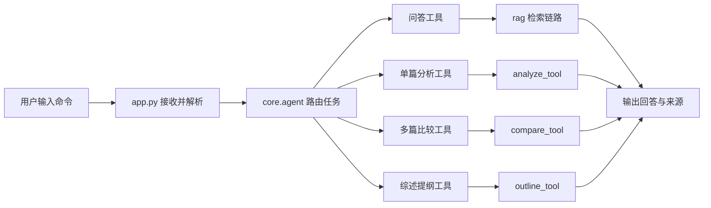

# 第 2 周：工具调用与模块化

> 这一周的重点不是继续堆功能，而是把“最小智能体”升级成“会调用多个科研工具的智能体”。

---

## 1. 本周目标

### 1.1 本周要完成什么

- 理解为什么“工具调用”是智能体能力升级的关键一步。
- 在已有最小闭环基础上增加多个科研工具接口。
- 跑通多篇论文比较与综述提纲生成。
- 看懂第二周新增代码和第一周基础模块之间的连接关系。

### 1.2 本周完成后应该清楚什么

- 为什么单一问答还不足以支撑科研任务。
- 为什么“工具”比“单个大模型回答”更适合组织学术任务。
- 为什么模块边界清楚，系统才容易继续扩展到多步流程和 RAG。

### 本节小结

第二周解决的是“从一个任务”到“多个科研任务”的问题。

---

## 2. 第二周的核心问题

1. 什么叫工具调用？
2. 为什么单篇分析、多篇比较、提纲生成要拆成不同工具？
3. 智能体怎样在命令行里把不同工具路由起来？
4. 工具模块化之后，后面为什么更容易接 LangChain、LangGraph 和更复杂流程？

### 本节小结

第二周真正要理解的不是命令本身，而是“任务如何被模块化”。

---

## 3. 从第 1 周到第 2 周，系统发生了什么变化

### 第 1 周已经有的能力

- 本地 PDF 解析。
- 基础切块与最小检索。
- 命令行问答。
- 单篇论文结构化分析。

### 第 2 周新增的能力

- 多篇论文比较工具。
- 综述提纲生成工具。
- 命令行中的工具路由。
- 更清楚的“智能体协调层 + 工具层”边界。

### 一个更准确的理解

第 1 周更像“能跑的最小系统”，第 2 周开始更像“围绕科研任务工作的系统”。

### 本节小结

系统从单功能原型，进入了多工具协作阶段。

---

## 4. 第二周总体结构

### 4.1 第二周后的任务流



### 4.2 第二周最重要的变化

- `core/agent.py` 不再只协调问答和单篇分析。
- `tools/` 目录中开始出现多个任务型工具。
- `app.py` 的命令分流更加明确。
- 整个项目更接近“科研任务调度器”而不是“单一脚本”。

### 本节小结

第二周的架构关键词是：分工、调度、复用。

---

## 5. 本周代码结构与新增模块

### 5.1 当前关键目录

```text
CityScholar-Agent/
├─ app.py
├─ core/
│  ├─ agent.py
│  └─ prompts.py
├─ rag/
│  ├─ loader.py
│  ├─ parser.py
│  ├─ splitter.py
│  └─ retriever.py
├─ tools/
│  ├─ analyze_tool.py
│  ├─ compare_tool.py
│  └─ outline_tool.py
└─ notebooks/
   ├─ 00_课程总览.ipynb
   ├─ 01_最小科研助教智能体.ipynb
   └─ 02_工具调用与模块化.ipynb
```

### 5.2 第二周新增文件职责

| 文件 | 本周作用 | 关键理解 |
| --- | --- | --- |
| `tools/compare_tool.py` | 对多篇论文做最小结构化比较 | 把多篇论文组织成一个比较任务 |
| `tools/outline_tool.py` | 根据若干论文生成综述提纲 | 把论文集合转成提纲结构 |
| `core/agent.py` | 新增多工具路由与响应对象 | 智能体开始像“协调者” |
| `app.py` | 新增 `compare` 与 `outline` 命令 | 用户可以直接调用不同科研工具 |

### 5.3 第二周新增的三个任务型工具

1. `analyze`：单篇论文结构化提取
2. `compare`：多篇论文最小比较
3. `outline`：综述提纲生成

### 本节小结

工具不是附属品，而是第二周的主角。

---

## 6. 第二周的工具设计思路

### 6.1 为什么先做“多篇比较”

多篇比较是科研任务中最自然的下一步，因为它直接连接：

- 文献阅读
- 文献归纳
- 研究差异识别
- 后续综述写作

### 6.2 为什么再做“综述提纲生成”

提纲生成是把“读论文”转向“组织输出”的关键一步。  
它说明系统已经不仅能读，还能开始组织研究写作结构。

### 6.3 第二周仍然坚持的原则

- 先保证最小可运行。
- 先做规则型稳定输出。
- 保留后续接入大模型增强的空间。
- 输出尽量结构化、可展示、可解释。

### 本节小结

第二周不是直接追求复杂智能，而是先把任务工具做稳。

---

## 7. 核心代码说明

### 7.1 `tools/compare_tool.py`

这个模块负责：

- 接收多篇论文全文。
- 调用已有的单篇分析逻辑。
- 汇总各篇论文的研究问题、方法、数据和发现。
- 输出一个适合命令行展示的最小比较结果。

#### 关键认识

多篇比较不是重新发明一套分析逻辑，而是在单篇分析结果之上继续组织。

### 7.2 `tools/outline_tool.py`

这个模块负责：

- 接收综述主题。
- 结合若干论文比较结果。
- 生成一个章节式、分项式的综述提纲。

#### 关键认识

提纲工具本质上是在做“结构化写作准备”。

### 7.3 `core/agent.py`

第二周后的 `core/agent.py` 负责：

- 问答
- 单篇分析
- 多篇比较
- 综述提纲生成

#### 关键认识

智能体的“智能”很多时候不在于自己写了多少内容，而在于它会不会调度合适工具。

### 7.4 `app.py`

第二周后的 `app.py` 新增命令：

- `compare`
- `compare 1,2`
- `outline 城市韧性研究综述`
- `outline 1,2,3 :: 城市韧性研究综述`

#### 关键认识

命令行虽然简单，但已经足够清楚地展示“任务识别 -> 工具调用 -> 输出结果”的流程。

### 本节小结

第二周的核心代码变化，主要发生在工具层和协调层。

---

## 8. 命令演示与观察点

### 8.1 查看论文列表

```text
papers
```

观察点：

- 当前有哪些论文可参与比较和提纲生成。
- 论文编号是否清晰，便于后续调用。

### 8.2 执行多篇比较

```text
compare
```

或：

```text
compare 1,2
```

观察点：

- 是否输出了纳入论文列表。
- 是否区分了共同主题、方法比较、数据比较和发现比较。
- 是否已经出现“多篇任务”的感觉，而不只是重复打印单篇结果。

### 8.3 生成综述提纲

```text
outline 城市韧性研究综述
```

或：

```text
outline 1,2,3 :: 城市韧性研究综述
```

观察点：

- 是否输出了章节标题。
- 每一节是否有具体要点。
- 提纲是否已经具备后续写成综述的基本骨架。

### 本节小结

第二周的演示重点，是让系统从“回答问题”升级为“组织科研任务”。

---

## 9. 代码观察单元

### 9.1 查看 `tools/` 目录

---

### 9.2 查看 `compare_tool.py` 中的核心数据结构

---

### 9.3 查看 `outline_tool.py` 中的提纲章节结构

---

### 9.4 查看 `app.py` 中新增的命令入口

---

## 10. 第二周的边界与不足

当前第二周版本仍然是最小实现，主要边界包括：

- 多篇比较仍然是规则式汇总，不是深层语义比较。
- 综述提纲是最小骨架，不是完整综述正文。
- 检索层还没有进入 embedding 阶段。
- 还没有正式引入工作流编排框架。

### 一个清楚的判断

第二周已经完成“工具调用与模块化”的教学目标，但还没有进入“多步流程编排”阶段。

### 本节小结

这一周的重点是把工具边界做清楚，而不是把所有高级能力一次做完。

---

## 11. 与后续周次的连接

### 向第 3 周延伸

当工具越来越多，系统就会遇到一个新问题：  
多个工具之间如何按顺序组织？如何保存中间状态？如何决定下一步调用哪个工具？

这正是第 3 周要解决的内容。

### 向第 4 周延伸

当系统开始做多篇比较和提纲生成后，检索质量的重要性会进一步上升。  
这会自然引出 embedding、向量索引与更完整的 RAG。

### 本节小结

第二周是后续“流程编排”和“知识增强”的中间桥梁。

---

## 12. 本周练习

### 练习 1

运行 `python app.py` 后，依次执行：

```text
papers
compare
```

观察默认比较是否基于前两篇论文完成。

### 练习 2

尝试指定论文：

```text
compare 1,2
compare 2,3
```

比较不同论文组合下，共同主题和方法对比有什么变化。

### 练习 3

尝试生成综述提纲：

```text
outline 城市韧性研究综述
outline 1,2,3 :: 城市韧性与治理研究综述
```

观察不同主题或不同论文组合是否会影响提纲结构和要点内容。

### 本节小结

练习的重点不是得到“完美综述”，而是理解工具如何协同完成任务。

---

## 13. 第二周总结

### 这一周真正新增了什么

- 系统开始具备多工具调用能力。
- 智能体从“最小问答原型”变成“最小科研任务调度器”。
- 多篇比较和提纲生成让系统更接近真实科研工作流。

### 这一周最重要的一句话

当系统能够围绕不同科研任务调用不同工具时，它才开始真正具备智能体的工作方式。

