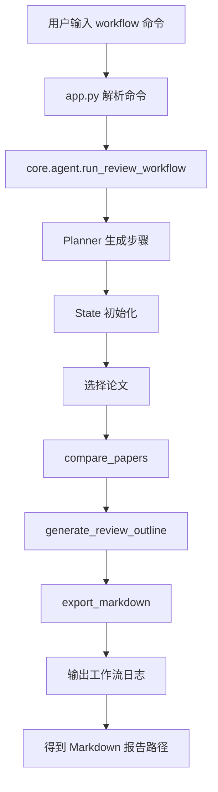

# 第 3 周：多步流程编排

> 这一周要解决的问题，不再是“有没有工具”，而是“多个工具如何按顺序组织成一个完整任务”。

---

## 1. 本周目标

### 1.1 本周要完成什么

- 理解为什么多工具系统一定会走到流程编排。
- 引入最小 `Planner / State / Workflow` 风格结构。
- 跑通一个完整多步流程：选论文 -> 比较 -> 提纲 -> 导出。
- 看懂第三周代码如何把第二周工具串成一个真正任务链。

### 1.2 本周完成后应该清楚什么

- 为什么多工具不等于多步流程。
- 为什么状态记录对智能体系统很重要。
- 为什么第三周是后续接 LangChain / LangGraph 的过渡层。

### 本节小结

第三周解决的是“任务如何连续推进”的问题。

---

## 2. 第三周的核心问题

1. 为什么第二周已经有多个工具，但还不能算多步工作流？
2. 什么是 Planner？
3. 什么是 State？
4. 一个科研任务为什么需要“步骤日志”和“中间产物”？
5. 为什么导出 Markdown 报告也是流程的一部分？

### 本节小结

第三周的关键词是：顺序、状态、产物。

---

## 3. 从第 2 周到第 3 周，系统发生了什么变化

### 第 2 周已经具备

- 单篇分析工具
- 多篇比较工具
- 综述提纲工具
- 命令行中的任务路由

### 第 3 周新增

- 工作流计划对象
- 工作流状态对象
- 多步工作流执行函数
- Markdown 导出工具
- `workflow` 命令入口

### 一个更准确的理解

第二周回答的是“工具怎么调用”，第三周回答的是“调用完一个工具后下一步怎么办”。

### 本节小结

第三周是从“模块集合”走向“任务链路”的关键一步。

---

## 4. 第三周总体结构

### 4.1 第三周后的流程图



### 4.2 第三周最重要的新增能力

- 系统开始保存“步骤状态”。
- 系统开始输出“步骤日志”。
- 系统能把多个工具执行结果汇总为一个最终产物。
- 系统开始接近“科研任务代理”的工作方式。

### 本节小结

第三周的重点不是让单个工具更强，而是让系统更会组织。

---

## 5. 第三周新增代码结构

### 5.1 当前关键目录

```text
CityScholar-Agent/
├─ app.py
├─ core/
│  ├─ agent.py
│  ├─ prompts.py
│  └─ workflow.py
├─ tools/
│  ├─ analyze_tool.py
│  ├─ compare_tool.py
│  ├─ outline_tool.py
│  └─ export_tool.py
└─ outputs/
```

### 5.2 第三周新增文件职责

| 文件 | 本周作用 | 关键理解 |
| --- | --- | --- |
| `core/workflow.py` | 保存计划、状态和工作流结果 | 第三周的核心结构文件 |
| `tools/export_tool.py` | 将流程结果导出为 Markdown | 把中间结果变成最终产物 |
| `core/agent.py` | 新增 `run_review_workflow` | 把多个工具串成一个多步任务 |
| `app.py` | 新增 `workflow` 命令 | 给用户一个直接触发多步流程的入口 |

### 本节小结

第三周新增的不是“更多分析函数”，而是“组织这些函数的流程层”。

---

## 6. Planner / State 的最小理解

### 6.1 Planner 是什么

在这个项目里，Planner 不是一个复杂大模型，而是一个“先把步骤列出来”的计划对象。

当前默认流程是：

1. 选择论文
2. 执行多篇比较
3. 生成综述提纲
4. 导出 Markdown 报告

### 6.2 State 是什么

State 用来保存流程运行过程中的关键内容，例如：

- 当前主题
- 已选择的论文
- 每一步的执行日志
- 多篇比较结果
- 综述提纲结果
- 导出文件路径

### 6.3 为什么第三周要强调它们

如果没有 Planner，系统就不知道先后顺序。  
如果没有 State，系统就无法记录中间产物，也没法把前一步结果传给后一步。

### 本节小结

Planner 决定“做什么”，State 决定“做到哪、手里有什么”。

---

## 7. 核心代码说明

### 7.1 `core/workflow.py`

这个模块负责：

- 定义 `WorkflowStep`
- 定义 `WorkflowPlan`
- 定义 `WorkflowState`
- 定义 `WorkflowRunResult`
- 提供工作流结果格式化和导出辅助函数

#### 关键认识

这里已经很接近 LangGraph 里的“节点 + 状态”思想，只是当前版本用的是更轻量的自定义实现。

### 7.2 `tools/export_tool.py`

这个模块负责：

- 组织 Markdown 文本
- 清洗文件名
- 把工作流结果导出到 `outputs/`

#### 关键认识

工作流如果没有最终产物，就还是停留在控制台演示层面。

### 7.3 `core/agent.py`

本周新增的关键方法是：

- `run_review_workflow`

它会顺序执行：

1. 选论文
2. 多篇比较
3. 生成提纲
4. 导出 Markdown

### 7.4 `app.py`

第三周新增命令：

- `workflow 城市韧性研究综述`
- `workflow 1,2,3 :: 城市韧性研究综述`

### 本节小结

第三周最关键的代码变化，不是工具层，而是“流程层”。

---

## 8. 演示命令与观察点

### 8.1 执行默认工作流

```text
workflow 城市韧性研究综述
```

观察点：

- 是否显示工作流完成状态
- 是否输出步骤日志
- 是否生成 Markdown 文件路径

### 8.2 指定论文执行工作流

```text
workflow 1,2,3 :: 城市韧性研究综述
```

观察点：

- 是否基于指定论文执行
- 选中的论文是否被写入工作流状态
- 导出报告是否包含比较结果与提纲结果

### 8.3 对照第二周命令理解差异

```text
compare 1,2,3
outline 1,2,3 :: 城市韧性研究综述
workflow 1,2,3 :: 城市韧性研究综述
```

观察点：

- `compare` 只做一步
- `outline` 只做一步
- `workflow` 会顺序完成多步并导出结果

### 本节小结

第三周演示的重点，是让系统开始表现出“任务链”。

---

## 9. 代码观察单元

### 9.1 查看 `core/workflow.py` 中的核心数据结构

---

### 9.2 查看 `tools/export_tool.py` 中的导出逻辑

---

### 9.3 查看 `core/agent.py` 中的 `run_review_workflow`

---

### 9.4 查看 `app.py` 中新增的 `workflow` 命令入口

---

## 10. 第三周的边界与不足

当前第三周版本已经具备最小流程编排能力，但仍然有明显边界：

- 还不是 LangChain / LangGraph 正式实现
- 计划步骤仍是固定顺序，不是动态规划
- 状态还比较简单，没有复杂分支和回滚
- 工作流质量仍然受第二周单工具质量限制

### 一个清楚的判断

第三周已经完成“流程编排”的核心教学目标，但还没有进入成熟工作流框架阶段。

### 本节小结

第三周的目标是“建立流程层”，不是一步到位做出工业级编排系统。

---

## 11. 与后续周次的连接

### 向第 4 周延伸

当工作流开始稳定后，系统的瓶颈就会重新回到“知识质量”。  
这会自然引出 embedding、向量索引、召回质量和知识增强。

### 向第 5 周延伸

当系统开始有多步流程后，就需要更认真地问：

- 每一步准不准？
- 导出结果是否可用？
- 流程有没有失败点？

这就是第五周的评估问题。

### 本节小结

第三周把系统推到了“可组织任务”的阶段，第四周和第五周会继续解决“质量”和“评估”。

---

## 12. 本周练习

### 练习 1

运行：

```text
workflow 城市韧性研究综述
```

记录：

- 使用了多少篇论文
- 生成了哪些步骤日志
- 导出的 Markdown 文件路径是什么

### 练习 2

运行：

```text
workflow 1,2,3 :: 城市韧性研究综述
```

观察：

- 指定论文是否影响最终导出结果
- 比较结果和提纲结果是否都被写入 Markdown

### 练习 3

对比下面三条命令的差异：

```text
compare 1,2,3
outline 1,2,3 :: 城市韧性研究综述
workflow 1,2,3 :: 城市韧性研究综述
```

### 本节小结

练习重点是理解“单步工具”和“多步流程”之间的本质差异。

---

## 13. 第三周总结

### 这一周真正新增了什么

- 系统开始具备最小 Planner / State 思维
- 多个工具第一次被串成一条完整任务链
- 系统开始产出可保存、可查看的 Markdown 报告

### 这一周最重要的一句话

当智能体不仅会调用工具，还会按顺序组织工具、保存状态并生成最终产物时，它才真正开始具备“流程能力”。

