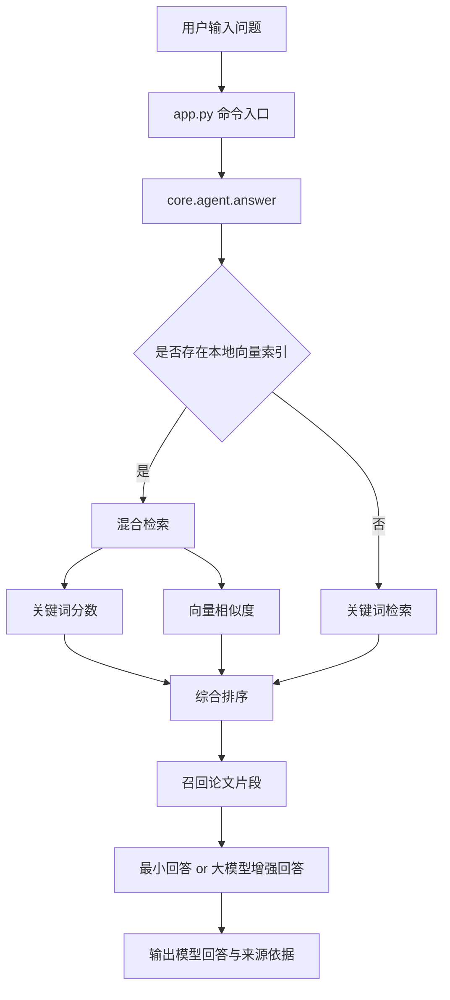

# 第 4 周：本地知识库与 RAG

> 本周要解决的问题是：系统已经能解析论文、比较论文、生成提纲，但为什么一换成真实英文论文，回答质量就开始不稳定？  
> 第 4 周的核心任务，就是把“本地论文库”真正升级成“可检索的知识底座”。

| 本周关键词 | 对应含义 |
| --- | --- |
| `embedding` | 把文本映射成可计算相似度的向量 |
| `向量索引` | 把论文片段的向量缓存到本地，避免每次重复计算 |
| `混合检索` | 关键词检索 + 向量检索联合召回 |
| `RAG` | 先检索，再基于检索结果生成回答 |

---

## 1. 本周目标

### 1.1 这一周要完成什么

- 理解为什么关键词检索在真实论文场景中会遇到瓶颈。
- 为本地论文片段构建 embedding 向量索引。
- 将混合检索接入现有问答链路。
- 保持最小可运行原则，不一开始就引入复杂向量数据库。

### 1.2 本周完成后需要清楚什么

- 为什么本地论文知识库不等于 RAG。
- 为什么 embedding 是“提升召回质量”的关键步骤。
- 为什么当前阶段仍然可以先使用本地 JSON 向量索引，而不是立刻引入 Milvus、FAISS、Chroma 等系统。

### 本节小结

第 4 周的重点不是“换一个更大的模型”，而是让系统更会找资料。

---

## 2. 当前系统为什么需要第 4 周

### 2.1 第 1 到第 3 周已经具备什么

- 第 1 周：最小问答闭环
- 第 2 周：多工具调用
- 第 3 周：多步流程编排

### 2.2 当前系统的真实瓶颈

前几周的系统已经能跑，但还会出现下面这些现象：

- 英文论文很多，中文问题不一定能稳定命中关键词。
- 问题换一种说法，召回结果可能立刻变化很大。
- 同义表达、跨语言表达、近义表达很难仅靠关键词命中解决。
- `workflow` 能跑通，但内容质量仍然受召回质量限制。

### 2.3 一个直接判断

如果系统“能调用工具”，但“找不到最相关片段”，后面的分析、比较、提纲都会被拖累。  
所以第 4 周补的不是新花样，而是知识检索底层能力。

### 本节小结

第 4 周是在给整个系统补“检索地基”。

---

## 3. 第 4 周的核心问题

1. 什么是 embedding？
2. 为什么 embedding 比纯关键词更适合真实论文语义匹配？
3. 为什么还要保留关键词检索，而不是完全换成向量检索？
4. 为什么现在使用“本地 JSON 向量索引”就够了？
5. RAG 到底是“检索 + 生成”还是“检索替代生成”？

### 本节小结

本周的关键词不是“炫技”，而是“召回质量”和“知识利用率”。

---

## 4. 第 4 周系统结构

### 4.1 新的知识流转图



### 4.2 这一周新增的关键能力

- 为每个论文切块生成向量
- 将向量缓存到 `data/processed/`
- 启动时尝试加载已有索引
- 问答时自动判断是否使用混合检索

### 本节小结

第 4 周并没有推翻前面的系统，而是在原有检索入口前补上一层更强的召回能力。

---

## 5. 第 4 周新增代码结构

```text
CityScholar-Agent/
├─ app.py
├─ config.py
├─ llm_dashscope.py
├─ core/
│  └─ agent.py
├─ rag/
│  ├─ retriever.py
│  └─ embedder.py
└─ data/
   └─ processed/
```

### 5.1 各文件职责

| 文件 | 本周职责 | 关键说明 |
| --- | --- | --- |
| `rag/embedder.py` | 构建、保存、加载本地向量索引 | 第 4 周新增核心模块 |
| `rag/retriever.py` | 新增混合检索逻辑 | 关键词检索保留，向量检索增强 |
| `llm_dashscope.py` | 新增向量接口调用 | 聊天和 embedding 共用同一客户端 |
| `core/agent.py` | 新增向量索引准备与混合检索路由 | 决定问答走哪条检索路径 |
| `app.py` | 新增 `build_index` / `rebuild_index` 命令 | 给命令行直接暴露第 4 周能力 |
| `config.py` | 新增 embedding 模型与维度配置 | 不做过度设计，只保留最小参数 |

### 本节小结

第 4 周不是简单增加一个脚本，而是把 embedding 接入主流程。

---

## 6. 什么是 embedding

### 6.1 一个最小理解

embedding 可以理解为：  
把一段文本转换成一组数字，这组数字能大致表示文本的语义位置。

### 6.2 为什么它有帮助

关键词检索更擅长找“字面上相同”的内容。  
embedding 更擅长找“意思上接近”的内容。

例如：

- 用户问中文：“城市韧性研究对治理有什么启示？”
- 论文正文是英文：“urban resilience provides policy implications for governance”

这种情况下，仅靠关键词不一定稳定，但向量相似度通常更有帮助。

### 6.3 一个重要提醒

embedding 不是自动让系统“更聪明”。  
它只是让系统更容易把对的片段找回来。

### 本节小结

embedding 主要解决“找得到”，不是直接解决“答得漂亮”。

---

## 7. 为什么采用混合检索

### 7.1 纯关键词检索的优点

- 直观
- 可解释
- 易于教学展示
- 不依赖额外向量接口

### 7.2 纯向量检索的优点

- 更能处理近义表达
- 更能处理跨语言表达
- 更适合问题写法不固定的场景

### 7.3 为什么不只保留其中一个

因为它们各自擅长不同问题：

- 关键词命中强时，可解释性更高
- 向量命中强时，语义覆盖更好

所以第 4 周采用的是：

```text
关键词分数 + 向量相似度 = 混合分数
```

### 本节小结

混合检索的价值，不是追求复杂，而是让系统既稳一点，又灵活一点。

---

## 8. 中文输出是否需要更换模型

### 8.1 结论

不需要。

### 8.2 为什么

当前已经接入的模型：

- `qwen-plus`
- `qwen-max`

本身就支持中文输出。  
系统最终显示成中文，关键不在于“文档是不是英文”，而在于“最后一层是否要求模型用中文总结”。

### 8.3 当前为什么还会看到英文内容

因为有些结果目前仍直接展示规则抽取出的英文原句，例如：

- 单篇分析中的字段值
- 多篇比较中的对比项
- workflow 中写入的中间结果

这说明的是“当前系统还保留了原始证据语言”，不是模型不会说中文。

### 8.4 一个清楚的判断

- 问答模块：已经可以通过大模型增强输出中文
- 多篇比较 / 工作流：当前仍偏“中文框架 + 英文证据”
- 后续如果需要更彻底的中文化，可以再加“中文总结层”

### 本节小结

中文输出不是模型更换问题，而是输出层设计问题。

---

## 9. 当前 workflow 结果是否正常

### 9.1 结论

从“系统流程”角度看，当前 workflow 结果是正常的。  
从“学术内容质量”角度看，当前 workflow 结果还只是最小可运行版本。

### 9.2 为什么说它正常

因为当前已经能完成：

1. 选论文
2. 多篇比较
3. 生成提纲
4. 导出 Markdown

这说明第 3 周的流程链路是通的。

### 9.3 为什么又说它还不够强

因为 workflow 的内容质量仍然依赖：

- 单篇分析是否抽得准
- 多篇比较是否比较得稳
- 检索是否召回到真正相关片段

这也是第 4 周必须补 embedding/RAG 的原因。

### 本节小结

workflow 现在“结构正常”，但“质量还在继续增强”。

---

## 10. 第 4 周的运行命令

### 10.1 启动程序

```bash
python app.py
```

### 10.2 构建本地向量索引

```text
build_index
```

### 10.3 强制重建本地向量索引

```text
rebuild_index
```

### 10.4 构建后执行问答

```text
城市韧性研究对城市治理有哪些启示？
```

### 10.5 对照演示建议

```text
papers
build_index
城市韧性研究对城市治理有哪些启示？
哪些论文关注城市安全或韧性？
workflow 1,2,3 :: 城市韧性研究综述
exit
```

### 本节小结

第 4 周最重要的新命令就是 `build_index`。

---

## 11. 课堂代码观察单元

### 11.1 查看 embedding 配置

---

### 11.2 查看 `rag/embedder.py` 中的索引结构

---

### 11.3 查看 `rag/retriever.py` 中的混合检索函数

---

### 11.4 查看 `core/agent.py` 中的检索路由逻辑

---

### 11.5 查看 `app.py` 中的 `build_index` / `rebuild_index` 命令入口

---

## 12. 代码单元占位

### 12.1 查看当前 embedding 配置

```python
from config import get_app_config

config = get_app_config()
print(config["dashscope_embedding_model"])
print(config["dashscope_embedding_dimensions"])
```

### 12.2 查看本地 processed 目录

```python
from pathlib import Path

processed_dir = Path("data/processed")
for item in processed_dir.glob("*"):
    print(item.name)
```

### 12.3 观察混合检索相关函数

```python
from pathlib import Path

text = Path("rag/retriever.py").read_text(encoding="utf-8")
print("retrieve_relevant_chunks_hybrid" in text)
```

### 12.4 观察向量索引模块

```python
from pathlib import Path

text = Path("rag/embedder.py").read_text(encoding="utf-8")
print(text[:1200])
```

---

## 13. 本周边界

当前第 4 周版本已经具备：

- 本地 embedding 索引
- 向量缓存
- 混合检索入口
- 与问答主流程的对接

但还没有做的包括：

- 专业向量数据库
- rerank 重排
- 更强的中文工作流总结层
- 更严格的检索评估指标

### 本节小结

第 4 周的目标是“把 RAG 最小闭环接上”，不是一次做完完整检索工程。

---

## 14. 与第 5 周的衔接

当第 4 周补上 embedding 和混合检索后，下一步自然会问：

- 召回质量到底提高了多少？
- 中文问句是否真的比之前更稳？
- 哪些问题仍然召回不好？
- workflow 的最终质量瓶颈还在哪里？

这些问题会直接进入第 5 周的“评估、边界与扩展”。

### 本节小结

第 4 周补的是能力，第 5 周要补的是判断能力。

---

## 15. 本周练习

### 练习 1

运行：

```text
build_index
```

记录：

- 是否成功生成向量索引
- 索引路径是什么
- 向量数量是多少

### 练习 2

分别在构建索引前后，测试同一个问题：

```text
城市韧性研究对城市治理有哪些启示？
```

观察：

- 是否更容易召回到相关片段
- 来源依据是否更接近主题

### 练习 3

运行：

```text
workflow 1,2,3 :: 城市韧性研究综述
```

思考：

- workflow 本身有没有问题？
- 还是它的问题主要来自上游检索和分析质量？

### 本节小结

第 4 周的练习重点，是观察“检索改进是否能传导到整个系统”。

---

## 16. 第 4 周总结

### 本周真正新增了什么

- 引入 embedding 概念到真实代码
- 为论文切块建立本地向量索引
- 将混合检索接入问答主流程
- 把第 3 周流程链路的知识底座补强了一步

### 本周最重要的一句话

当系统开始不仅“按关键词找文本”，而是“按语义找证据”时，本地论文助手才真正开始进入 RAG 阶段。
